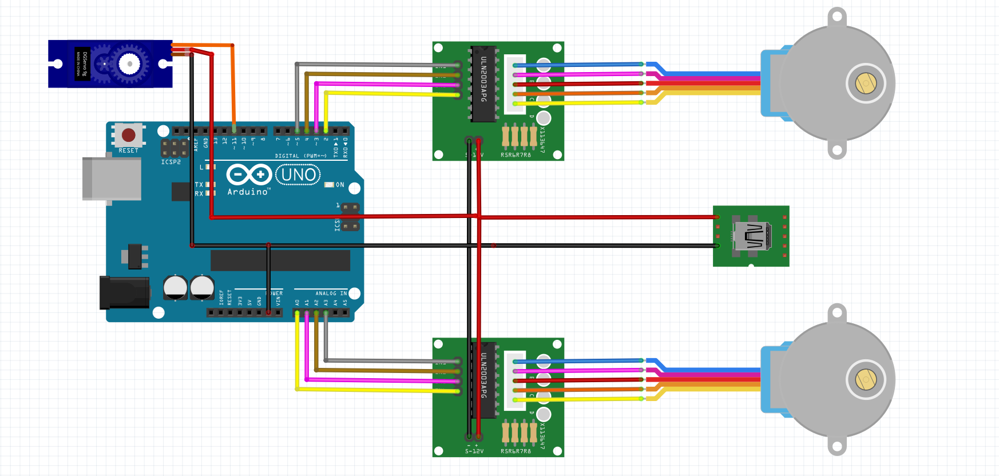

# 🖊️ Arduino 2D Pen Plotter

A compact two-axis **Arduino-driven pen plotter** that draws shapes and text on paper using two stepper motors, timing belts, and a servo-controlled pen-lifting mechanism.

This project was developed as the **Individual Project** for the EPFL “Making Intelligent Things” course (Spring 2025).  
It combines **mechanical design (CAD + laser cutting + 3D printing)** with **embedded control programming** on Arduino.

---

## ✨ Overview

The 2D Plotter translates digital drawings into physical motion through:
- **Two orthogonal linear axes** (X and Y) driven by 28BYJ-48 stepper motors via GT2 belts,  
- A **servo-actuated pen holder** for lift/lower control, and  
- An **Arduino Uno** that synchronizes both movements using the AccelStepper library.

---

## 🧠 Hardware Architecture

| Category | Component | Function |
|-----------|------------|-----------|
| **Microcontroller** | Arduino Uno | Central controller for motion and servo commands |
| **Motors** | 2 × 28BYJ-48 5 V steppers | Drive X- and Y-axis movement |
| **Motor Drivers** | 2 × ULN2003 boards | Control signals from the Uno to the stepper coils |
| **Servo** | SG90 9 g servo | Raises and lowers the pen |
| **Transmission** | 2 × GT2 belts (40 cm & 62 cm) + 2 × GT2 pulleys (5 mm) | Belt-driven linear motion |
| **Structure** | Combination of laser-cut MDF parts and 3D-printed PETG components | Provides a stable and lightweight frame |
| **Power** | 5 V USB breakout board + micro-USB cable | Dedicated supply for motors and servo |

All grounds are common between Arduino, stepper drivers, and servo.  
External 5 V power avoids overloading the Arduino’s regulator.

---

## 🧱 Mechanical Design

The complete mechanical assembly is provided in [`/cad/design.step`](cad/design.step).

The pen holder uses a **spring-loaded sliding design**:  
when the servo moves down, the pen holder can **slide backward slightly** against the spring tension.  
This prevents excessive pressure on the pen tip and protects the servo gears from overload, ensuring smoother contact with the paper surface and more consistent line thickness during plotting.

---

## 🧩 Electronics Diagram

  
---

## 💾 Programming Assignment 1 — Square and Inscribed Circle

This is the **first programming assignment implemented for the Arduino 2D Pen Plotter project**.  
Its goal is to verify the synchronization of both stepper motors and demonstrate precise two-axis motion by drawing a **square followed by an inscribed circle**.

The code uses the [AccelStepper](https://www.airspayce.com/mikem/arduino/AccelStepper/) library in **FULL4WIRE mode** to drive two 28BYJ-48 motors via ULN2003 driver boards.  

| Section | Purpose |
|----------|----------|
| **Config** | Defines motion parameters such as steps per side (`SIDE_STEPS = 4000`), motor directions (`DIR_X`, `DIR_Y`), and motion tuning (`MAX_SPEED`, `ACCEL`). |
| **Motors setup** | Two `AccelStepper` objects are created—one for each axis—with pins matching the ULN2003 driver connections. |
| **`moveToXY_blocking()`** | Core function that performs synchronized absolute moves by calling `X.run()` and `Y.run()` until both reach target positions. |
| **`setup()`** | Initializes motors, sets speed/acceleration, resets positions, and executes the entire motion sequence: a square followed by an inscribed circle. |
| **`loop()`** | Empty — all drawing occurs once during setup. |

---

## 💾 Programming Assignment 2 — Autopen Text Writing in D’Nealian Cursive

This is the **final programming assignment** of the “Making Intelligent Things” project.  
The task, as specified in the course handout, was to **create an autopen program** that writes text typed into the Arduino IDE **Serial Monitor** in *D’Nealian cursive*.

The implementation supports:
- **At least 15 lowercase letters** (`d e f h k l m n p r t u v w x`) - we can easily add the other letters.
- **Whitespace** and **line breaks**
- Up to 40 characters total per console input, with line wrapping after 7 characters

Letters in each word are **smoothly connected**, and the **pen lifts** between strokes (such as for ‘i’ or ‘x’) to mimic real cursive handwriting.

This assignment combines every subsystem of the plotter:
| Module | Description |
|---------|-------------|
| **Stepper control** | Handles synchronized XY movement for precise character tracing |
| **Servo actuation** | Lifts or lowers the pen between strokes (`penUp()` / `penDown()`) |
| **Serial interface** | Receives characters from Serial Monitor input |
| **Font data** | Stored in [`letters_all.h`](code/letters_all.h) — coordinate arrays extracted from SVG letters |
| **Plot logic** | Converts SVG units to stepper steps with calibrated scale and spacing |

---

### 🧩 SVG → Arduino Pipeline

1. A Python utility [`extract_letters_batch.py`](code/extract_letters_batch.py) converts vector paths from a reference SVG alphabet into arrays of (x, y) coordinates.
2. The raw coordinates were **manually adjusted and rescaled** to align all glyphs on a common baseline and spacing — resulting in the final [`letters_all.h`](code/letters_all.h) file.
3. The Arduino firmware reads these arrays from PROGMEM and draws them sequentially as the user types.

This fine-tuning ensures that **words appear evenly aligned and continuous** when drawn in one line, avoiding uneven jumps or overlaps between letters.

